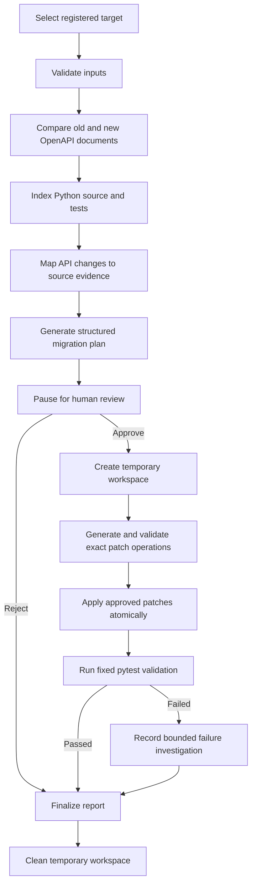

# API Migration Agent

A proof-of-concept project for analyzing breaking API changes and migrating
affected Python client code through a human-approved LangGraph workflow.

The project combines deterministic OpenAPI and source-code analysis with two
strictly structured Gemini boundaries: migration planning and exact patch
proposal generation. Generated output is never treated as authoritative;
deterministic Python code validates every referenced change, evidence item,
target file, approval, and patch precondition before anything is modified.

## Project status

This repository contains a complete, tested MVP workflow exercised with the
bundled **AtlasPay Python client**.

- The FastAPI backend implements the complete analysis, planning, approval,
  temporary patching, pytest validation, and reporting workflow.
- The Next.js interface is a real human-review client for that backend.
- AtlasPay is the only production-registered target at present, making the example
  repeatable and keeping its expected results under automated test.
- The analysis and orchestration layers use typed repository and OpenAPI paths,
  but arbitrary local-repository registration is not exposed by the current API
  or web interface.
- Automated tests use deterministic LLM fakes and require no provider credential.
  A real Gemini end-to-end run remains an explicit manual smoke test.

This is a proof of concept, not a hosted service that safely executes
repositories supplied by untrusted users.

## The problem

An API change can break client applications in several places at once:

- an operation is removed or moved;
- a request parameter becomes required;
- a request or response property changes;
- a schema type changes;
- an authentication requirement changes.

An OpenAPI diff identifies contract changes, but a developer still needs to
answer:

1. Which changes are breaking?
2. Where is each changed API element used in the client repository?
3. Which edits are supported by evidence?
4. Which business decisions require a person?
5. Did the approved edits pass the existing test suite?

API Migration Agent connects these stages into one reviewable workflow.

## How it works



### 1. Deterministic contract analysis

The analyzer loads bounded OpenAPI 3.x JSON documents and runs the implemented
compatibility rules. It detects supported operation, parameter, request-body,
response, schema-type, and security changes. The LLM does not decide whether a
change exists.

### 2. Deterministic repository impact mapping

The repository analyzer indexes Python files under `src/` and `tests/`, records
their hashes, parses them without importing them, and locates exact baseline API
terms. Each match is connected to a change ID, relative file, line, enclosing
symbol, source context, and confidence level.

### 3. Structured agentic planning

Gemini is accessed through LangChain and LiteLLM. It receives bounded,
structured change and repository evidence and returns a Pydantic-validated
migration plan. The planner rejects unknown changes, evidence, files, or invalid
relationships.

### 4. Human-in-the-loop review

LangGraph pauses before workspace creation. The user reviews proposed actions,
answers required business questions, and explicitly approves or rejects the
plan. Rejection terminates the run without patching.

### 5. Confined patch generation and application

Approved files are copied to a temporary workspace. A second structured Gemini
call proposes exact replacements, which are accepted only when they match the
approved action, deterministic evidence, target file, and a unique expected
text precondition. Python syntax is checked before atomic file replacement.

### 6. Fixed validation and reporting

The backend runs only `python -m pytest` with `shell=False`, a timeout, a
sanitized environment, and the temporary workspace as its working directory.
The final report distinguishes confirmed changes, repository evidence, proposed
and approved actions, modified files, human decisions, validation results, and
remaining uncertainty.

## Deterministic versus LLM responsibilities

| Responsibility | Deterministic Python | Gemini |
| --- | :---: | :---: |
| Load and validate OpenAPI documents | Yes | No |
| Detect API changes | Yes | No |
| Index repository files and hashes | Yes | No |
| Locate affected Python source | Yes | No |
| Propose an evidence-backed migration plan | Validates | Proposes |
| Approve actions and business values | Human | No |
| Propose exact patch operations | Validates | Proposes |
| Enforce workspace and patch boundaries | Yes | No |
| Apply file modifications | Yes | No |
| Run pytest and determine its result | Yes | No |
| Produce verified report metadata | Yes | No |

The central design principle is:

> The model proposes; deterministic evidence and human approval decide.

## Bundled AtlasPay example

[`examples/atlaspay`](examples/atlaspay) contains:

- an old OpenAPI contract;
- a new OpenAPI contract;
- a synthetic Python client repository;
- reviewed expected API-change fixtures;
- tests used by the validation stage.

The web interface loads AtlasPay from the backend target catalog and exercises
the complete workflow. AtlasPay is a controlled fixture, not hidden
AtlasPay-specific logic inside the analyzer: the comparison, repository mapping,
planning, patching, and validation services operate on injected typed inputs.

This controlled target makes the workflow reproducible and allows
the automated suite to assert exact expected changes, evidence relationships,
patch behavior, validation outcomes, and preservation of the original files.

## Architecture

```text
Next.js web interface
        │
        ▼
FastAPI routes and dependencies
        │
        ▼
PlanningWorkflowService
        │
        ▼
Typed LangGraph state, nodes, and conditional edges
        │
        ├── deterministic OpenAPI analysis
        ├── deterministic Python repository analysis
        ├── structured LangChain/LiteLLM clients
        ├── human-review interrupt
        ├── temporary workspace and exact patch applier
        ├── fixed pytest validation runner
        └── deterministic report renderer
```

Layer dependencies follow this direction:

```text
core
  ↑
domain
  ↑
analysis / execution
  ↑
services / agents
  ↑
api
```

Replaceable boundaries use protocols and constructor injection. FastAPI routes
remain thin, graph nodes delegate low-level work, and deterministic analysis is
independent of the model provider.

## Technology stack

### Backend

- Python 3.12+
- FastAPI
- LangGraph
- LangChain
- LiteLLM
- Gemini as the default configured provider
- Pydantic and pydantic-settings
- pytest
- Ruff
- mypy
- uv

### Frontend

- Next.js 16
- React 19
- TypeScript
- Tailwind CSS
- Vitest
- Testing Library
- pnpm

## Repository structure

```text
api-migration-agent/
├── api-migration-agent-backend/
│   ├── src/api_migration_agent/
│   │   ├── agents/          # LangGraph state, nodes, edges, dependencies
│   │   ├── analysis/        # Deterministic OpenAPI and repository analysis
│   │   ├── api/             # FastAPI composition and routes
│   │   ├── application/     # Production graph composition
│   │   ├── core/            # Configuration, exceptions, logging
│   │   ├── domain/          # Immutable workflow value objects
│   │   ├── execution/       # Execution protocols
│   │   ├── infrastructure/  # LLM, workspace, patch, validation adapters
│   │   └── services/        # Planning, validation, reporting orchestration
│   ├── tests/
│   ├── pyproject.toml
│   └── uv.lock
├── web/
│   ├── src/app/
│   ├── src/components/
│   ├── src/lib/
│   └── pnpm-lock.yaml
├── examples/atlaspay/
└── docs/
```

## Running locally on Windows

### Prerequisites

- Python 3.12 or newer
- [`uv`](https://docs.astral.sh/uv/)
- Node.js 20 or newer
- [`pnpm`](https://pnpm.io/)
- A Gemini-compatible provider credential only for the manual provider run

### 1. Install backend dependencies

```powershell
cd api-migration-agent-backend
uv sync
```

### 2. Run backend quality checks

```powershell
uv run ruff check .
uv run ruff format --check .
uv run mypy src
uv run pytest
```

The automated suite uses deterministic provider fakes and does not require a
real credential or network service.

### 3. Configure the manual Gemini run

Set only the explicitly named values in the current PowerShell session. Never
commit or print the credential.

```powershell
$env:API_MIGRATION_AGENT_PLANNING_MODEL = "gemini/gemini-2.5-flash"
$env:API_MIGRATION_AGENT_PLANNING_API_KEY = "replace-me-locally"
```

Configuration names and safe placeholders are documented in
[`docs/configuration.md`](docs/configuration.md). This repository intentionally
does not provide an environment-file template.

### 4. Start the backend

From `api-migration-agent-backend/`:

```powershell
uv run uvicorn api_migration_agent.api.main:app --reload
```

The API is available at `http://localhost:8000`, with interactive documentation
at `http://localhost:8000/docs`.

### 5. Install and start the frontend

In another PowerShell terminal, from the repository root:

```powershell
cd web
pnpm install
pnpm run dev
```

Open `http://localhost:3000`.

The frontend uses `pnpm`; npm is not part of the project workflow.

### 6. Run frontend quality checks

```powershell
pnpm run lint
pnpm run typecheck
pnpm run test
pnpm run build
```

## Using the bundled example

1. Start the backend with the locally configured Gemini provider.
2. Start the Next.js interface.
3. Confirm that the interface reports `Backend ready`.
4. Select `AtlasPay Python client`.
5. Start migration analysis.
6. Review the proposed actions, affected files, evidence-backed risks, and any
   required human questions.
7. Approve or reject the plan.
8. For approval, observe patch generation, confined application, pytest
   validation, cleanup, and the final report.
9. Confirm that the bundled original AtlasPay repository remains unchanged.

## API surface

| Method | Endpoint | Purpose |
| --- | --- | --- |
| `GET` | `/health` | Return non-sensitive operational status |
| `GET` | `/api/v1/migrations/targets` | List content-safe registered targets |
| `POST` | `/api/v1/migrations` | Start analysis for a stable target ID |
| `POST` | `/api/v1/migrations/{run_id}/review` | Resume with human approval or rejection |
| `GET` | `/api/v1/migrations/{run_id}` | Retrieve the latest safe run snapshot |

See [`docs/api.md`](docs/api.md) for the typed request and response walkthrough.

## Safety and trust boundary

The MVP includes application-level protections appropriate to its controlled
example workflow:

- bounded OpenAPI JSON loading;
- local `$ref` resolution only;
- Python parsing without importing analyzed modules;
- relative-path confinement and symlink rejection;
- hash checks before reading, copying, and patching;
- explicit human approval before workspace creation;
- exact, unique patch preconditions;
- Python syntax validation before atomic replacement;
- a fixed pytest command with `shell=False` and a timeout;
- structured allowlisted logging;
- sanitized API and domain errors;
- cleanup of creator-owned temporary workspaces.

A temporary directory protects the original repository from accidental
modification; it is not an operating-system sandbox for malicious code. The
current project therefore does not claim safe execution of arbitrary public
repositories.

## Current limitations

- The production target catalog currently contains only AtlasPay.
- Local repository paths, uploads, and Git URLs are not accepted by the API.
- Only OpenAPI 3.x JSON is supported; YAML and remote references are absent.
- Compatibility detection is intentionally bounded and does not claim complete
  OpenAPI coverage.
- Repository analysis currently targets Python files under `src/` and `tests/`.
- The validator runs existing pytest tests; it does not generate new tests or
  install project dependencies.
- Runs are stored in memory and disappear when the backend restarts.
- The MVP is single-process and is not intended for multiple backend workers.
- Raw subprocess output is discarded, so automatic repair is skipped when no
  safe structured failure evidence exists.
- No authentication, durable database, Docker execution, remote tracing,
  automatic GitHub operation, or public repository execution is implemented.
- Real Gemini provider verification is a manual smoke test rather than part of
  the automated suite.

## Future improvements

These are roadmap items, not implemented capabilities:

1. **Trusted local project input** — add a CLI or operator-controlled registry
   for repository, old-specification, and new-specification selection.
2. **Improved evidence presentation** — show the complete change → source
   evidence → approved action → patch → validation chain in the web report.
3. **Additional OpenAPI support** — YAML, broader schema composition, and more
   compatibility rules.
4. **Durable run history** — replace process-local memory with an audit-ready
   persistence implementation behind the existing store protocol.
5. **Structured validation diagnostics** — extract bounded failure categories
   without exposing arbitrary test output.
6. **Broader language support** — add repository analyzers for other client
   languages behind deterministic interfaces.
7. **Hosted execution isolation** — use a verified OS-level sandbox before ever
   accepting and executing untrusted public repositories.

## Why this project is agentic

The application is not a chat wrapper. It is a typed, stateful workflow in which:

- deterministic tools establish facts;
- Gemini reasons only over validated evidence;
- LangGraph controls execution order and conditional routing;
- the graph pauses for an external human decision;
- approved state determines whether mutation is permitted;
- generated operations are validated before execution;
- deterministic validation feeds a terminal outcome.

The workflow combines autonomous reasoning with explicit tools, state,
constraints, and human control.

## Contributing

Contributions should preserve the separation between deterministic facts, model
inference, human decisions, and verified execution results.

Before proposing a change:

1. Keep the implementation focused on one complete behavior.
2. Add or update unit and integration tests for the affected boundary.
3. Do not introduce real credentials, provider calls in tests, arbitrary command
   execution, or source-content logging.
4. Preserve the original AtlasPay fixture during execution tests.
5. Run the relevant backend and frontend quality commands documented above.
6. Update public documentation when behavior or API schemas change.

Bug reports and feature proposals should describe the expected behavior, current
behavior, reproducible inputs, and the relevant security or compatibility
constraints. Do not include credentials, private repositories, or protected
configuration in issues or test fixtures.

## Additional documentation

- [Backend implementation](api-migration-agent-backend/README.md)
- [Frontend implementation](web/README.md)
- [API contract](docs/api.md)
- [Configuration](docs/configuration.md)
- [Temporary workspaces](docs/workspaces.md)
- [Provider smoke test](docs/provider-smoke-test.md)
- [Implementation status](docs/implementation-status.md)
- [Repository intake security contract](docs/repository-intake-security.md)
